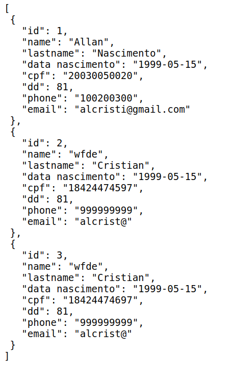
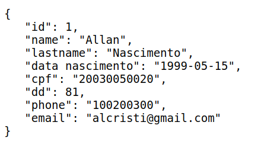
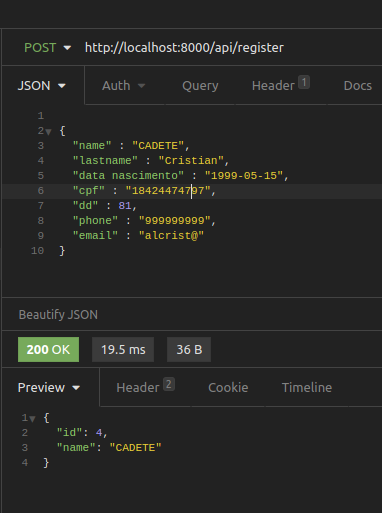

# Endpoints
## /api/user
- Ele retorna um json de todos usuários cadastrados.
- Só aceita o método GET
- Exemplo:  

## /api/user/id
- Ele retorna um json de um usuário cadastrado pelo ID de cadastro
- Só aceita o método GET
- Exemplo:  

## /api/register
- Ele permite o cadastro de novos usuários enviando um JSON pelo body, e ele retorna para confirmar o ID de cadastro e o nome do novo usuário cadastrado.
- Só aceita o método POST
- Exemplo:  

