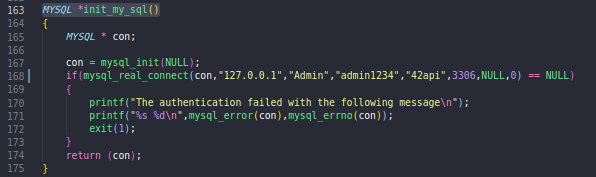
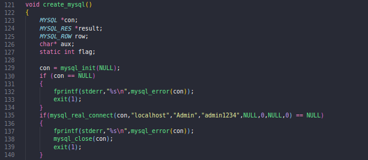
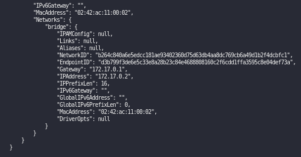
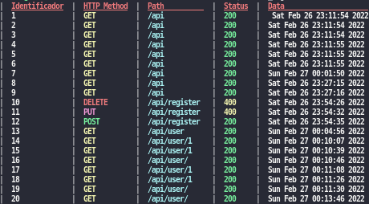
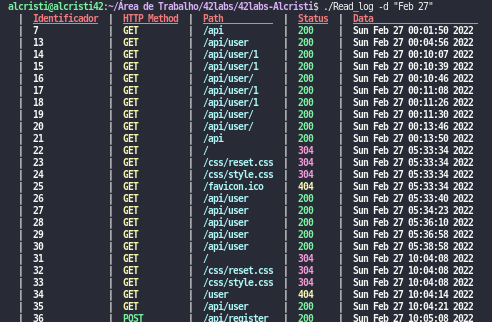
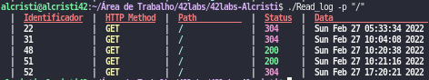

# 42API
O 42API é um API implementada com Arquiterua Rest, que fornece informações de cadetes cadastrado no banco de dados em formato JSON
## Sumário
 [Tecnologias Utilizadas](#tecnologias-utilizadas)

  [Como foi desenvolvida](#como-essa-api-foi-desenvolvida)

  [Funcionamento](#como-funciona)

  [Como executar](#como-executar)

  [Read_log](#execu%C3%A7%C3%A3o-sem-flag)

  [Comando Make](./Document/Make.md)

  [Endpoints](./Document/Endpoint.md)


 ## Tecnologias Utilizadas
 - ANSI C
 - GNU MAKE
 - Mysql Server
 - C API Mysql
 - Mongoose web server
 - Lib MJSON
 - Docker
 ## Como essa API foi Desenvolvida 
 Essa aplicação foi construída buscando desenvvolver habilidades com API Rest, e de um modo desafiador pois a ANSI C não é a linguagem mais fácil de lhe dar com esse tipo de aplicação, logo eu precisei recorrer ao [Mongoose](https://github.com/cesanta/mongoose) que possui uma biblioteca de rede incorporada para C/C++, ela fornece um conjunto muito bom de funções que facilita no desenvolvimento de APIs. Álem disso, foi utilizado a [Lib MJSON](https://github.com/cesanta/mjson) que facilitou a utilização JSON nessa aplicação com o seu conjunto de funções. Utilizando pela primeira vez bancdo de dados, a API que á propria Mysql fornece uma maneira muito intuitiva de acessar o banco de dados utilizando a linguagem C.
 ## Como Funciona
42Api é uma aplicação que se comunica com o um banco de dados e fornece um Json com as informações dos cadetes cadastrados, atráves do endpoint /api/user, ela também permite que esses sejam selecionados pelo o seu id utilizando /api/user/id. Álem disso, ela possui um endpoint /api/register que possibilita o cadastramento de novos cadetes.
 ## Como executar
 Essa APi foi desenvolvida em Sistema Linux, logo o passo a passo para sua execução é baseado nesse SO.Segue abaixo os pacotes,libs e programas que você tem que ter para conseguir executar, caso falte algum na hora que você rodar, a saída de error vai indicar, logo  você só precisa rodar o comando ao lado com o seu gerenciador de pacote para baixar.
 
### Dependecias : 

 | Pacotes  |      Comandos      |
|----------|:-------------:|
|    Make  |    sudo apt-get install build-essential |
|    Gcc   |    sudo apt-get install build-essential   |
|   Mysql  | sudo apt-get install mysql-client8.0 mysql-server8.0 |

### Libs : 
 | Pacotes  |      Comandos      |
|----------|:-------------:|
|    libmysqlclient  |   sudo  apt-get install libmysqlclient-dev |
|    libpthread   |    sudo apt-get install libpthread-stubs0-dev  |
|  libz   |sudo apt-get install libpthread-stubs0-dev |
|  libssl   | sudo apt-get install libssl-dev |
|  libcrypto  |sudo apt-get install libssl-dev |

- Para executar a aplicação é preciso fazer duas coisas
  1. Clonar esse repositório na sua máquina, e na raiz executar o comando
  ``` make ``` no seu terminal.
  2. Configurar o Banco de dados
## Configuração do Banco de dados
### Caso 1
Você já está com o mysql configurado no seu computador, e possui um usuário álem do root, com permissão de administrador.
- Você só vai precisar ir no arquivo [./database/database.c](./database/database.c) nas funções:
   - Função ```MYSQL *init_my_sql()```
  
   - Função ```void create_mysql()```
  

- Na linha 168 ```MYSQL *init_my_sql()``` e linha 135 ```void create_mysql()``` e alterar "Admin" pelo seu usuário e "admin1234" pela sua senha.
### Caso 2
1. Utilizando a imagem docker dentro do ```database```
   - Como ela já vem configurada você so precisar ir no container e rodar ele para ter acesso ao banco de dados
      1. Execute ``` docker build -t mysql-image -f ./api/db/Dockerfile .``` para criar a imagem com as configurções feitas, você pode executar `docker image ls` para verificar se a imagem foi construída.
      2. Execute ` docker run -d --rm --name mysql-container mysql-image` para criar um container, cujo a mysql-image vai tá rodando dentro, para verificar se o container está rodando corretamente `docker ps`
   - Agora você precisa configurar para que a conexão seja feita com mysql do docker.
      1. Execute `docker inspect mysql-container`, para você ter acesso as informações do container, inclusive o `IP`.<br>
      <br>
      2. Com o `IP`em mãos, vá até as funcões do caso 1, e altere na mesma linha que foi indicada acima, mas nesse caso é o segundo parâmetro no ```MYSQL *init_my_sql()``` está `"127.0.0.1"` e no
      ```void create_mysql()``` está localhost, pelo endereço de `IP` do container.
      3. Após isso e só roda o programa normalmente, a primeira vez vai criar a tabela e cadastrar o primeiro cadete.
      4. Caso você queira acessar o `mysql` pela linha de comando, você pode executar `docker exec -it  mysql-container /bin/bash`, e acessar com `mysql -u user -p`
### Caso 3
Você não tem o ambiente mysql configurado e precisa criar um usuário para rodar a API.
1. Primeiro execute o comando ```sudo mysql_secure_installation```
   - Ele vai permitir que você faça uma configuração segura e passo a passo
   - A primeira solicitação é a configuração da senha do usuário root
   - Depois ele pergunta se você quer remove os usuários anonymous, que é usado em ambiente de teste para que qualquer um entre dentro do DB, como vamos criar nosso próprio usuário podemos colocar 'Sim' mesmo sendo um ambiente de teste;
   - Depois ele pergunta se você quer desabilitar o acesso remoto do root, é válido pois vamos acessar do localhost.
   -Pergunta se você quer remove o database de teste, como nosso API não vai para produção podemos colocar que 'Não'
   - E por último ele pergunta se você que recarregar os privilegios das tabelas, pode colocar que 'Sim' 
2. Após isso você vai ter o seu usuário root configurado, podemos acessar o mysql pela linha de comando e criar nosso usuário.
   - Execute o comando ```sudo mysql -u root -p```
   - Após isso o mysql vai está rodando no seu terminal.
   - Execute o comando ```CREATE USER '**nome_do_usuario**'@'localhost' IDENTIFIED BY '**senha_do_usuário**';``` (Obs: Indicado você colocar "Admin" como nome do usuário e "admin1234" como senha, pois esses já estão configurados no código, caso queira colocar outro faça o caso 1)
   - Depois de criar o Usuário você precisa da permissão a ele.
   - Para isso execute ```GRANT ALL PRIVILEGES ON *.* TO 'Admin'@'localhost';```(OBS: Não é indicado criar um usuário com tanto poder assim, ele pode fazer tudo em todo banco de dados, mas como intuito é aprender vamos configurar dessa forma).
   - É por fim execute  ```FLUSH PRIVILEGES;``` para carregar as permissões consedida ao novo usuário
### Erros comuns:
1- Can't connect to local MySQL server through socket '/var/run/mysqld/mysqld.sock' (2)
   - Ocorre porque o 'service' mysql está inativo e só executar ```sudo service mysql start```
   
2- Acesso negado a '*'@localhost
   - Ocorre normalmente porque o usário não tem permissão de acesso ao db

3- ERROR 1819 (HY000): Your password does not satisfy the current policy requirements
   - Caso toda senha que você coloque não de certo, você pode modificar a exigência dela.
      1. Você pode verificar quais são os padrões que está sendop solicitado executando ```show global variables like 'validate_password%';```, no mysql na linha de comando.
      2. Para modificar para uma fiscalização de senha de nível mais baixo, pois o objetivo e fazer testes pode executar ```SET GLOBAL validate_password.policy=LOW;```
## Execução   
Depois de configurar o banco de dados e só rodar o comando ```make ``` e executar o programa ```./Api42```

# Read_log - CLI
O Read_log é uma aplicação de linha de comando, que foi criada para organizar e simplificar a leitura do logApi, da API42. Ele organiza em um tabela cada request e seu resultado de forma clara e organizada.
Álem disso ele tem algumas flags que permite que você consiga selecionar a data, endpoints ou os métodos HTTP.

### Execução sem flag
Ele vai mostrar em uma tabela todos os requests feito naquela API, dependendo do tempo isso pode fazer com que ele demore uma pouco para carregar.
- Para executar é só rodar ```./Read_log``` na linha de comando 



### Execução com a flag -d
A flag '-d' permite que você selecione um dia e mês específico
1. Execute ```./Read_log -d "Feb 27"```
   - Ele só vai pegar os logs do dia 27 de fevereiro
   - O mês será a três primeira letras do mês que você quer em inglês 
      - Exemplo:<br> 
      "February" = "Feb"<br>
      "March" = "March"
   - Saída do comando acima:<br>
    
   ### Execução com flag -m
   A flag -m permite que você selecione um método específico para visulizar as chamada com aquele método.
   1. Execute ```./Read_log -m "POST"```
      - Ele vai pegar só as requests que usaram esse método<br>
      - Saída do comando acima<br>
      
  ### Execução com flag -p
   A flag -p permite que você selecione um endpoint específico para visulizar as chamada com naquele endpoint.
   1. Execute ```./Read_log -p "/"```
      - Ele vai pegar só as requests nesse endepoint<br>
      - Saída do comando acima<br>
      
# Licensa
Esse projeto é sob a [GNU General Public Licensa V3](./LICENSE)


                


 
